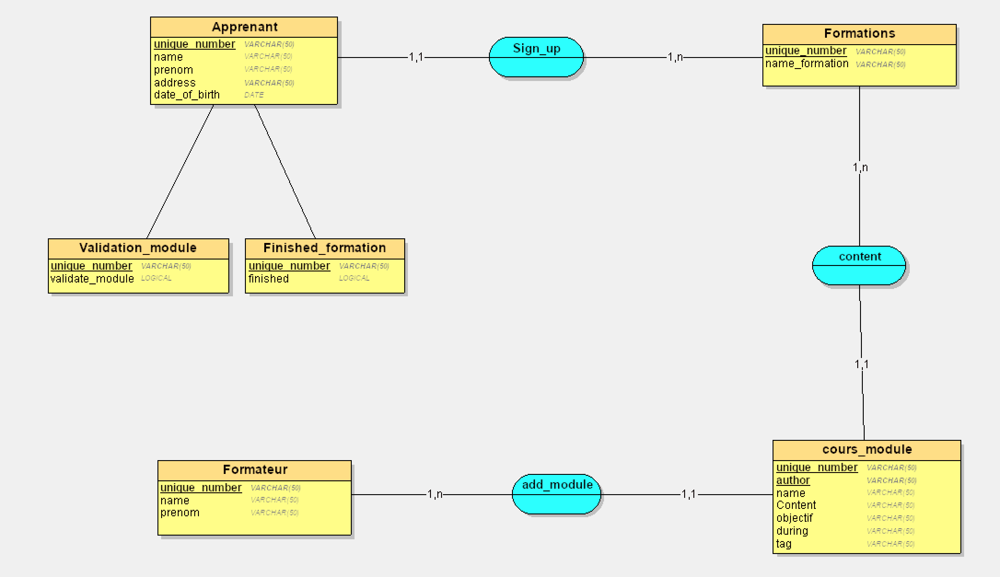
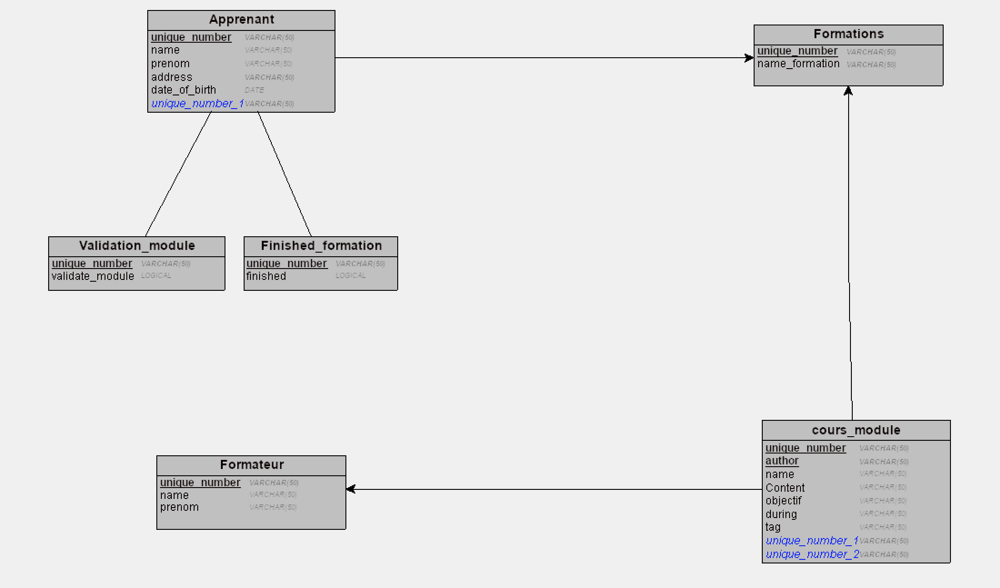

# Qu'est ce que Merise ?

## Merise ( qui se prononce _meurise_ non pas _mérise_ ) est une methode d'analyse, de conception de gestion de projet informatiques.

## Quel est la définition de l'acronyme MERISE:

- _M_éthode
- _É_tude
- _R_éalisation
- _I_nformatique
- _S_ystème
- _E_ntreprise

---

## Le dictionnaire des donnèes qu'est ce que c'est ?

### C'est une étape intermédiaire qui peut avoir son importance surtout si on travaille en groupe sur la même base de données. C'est un document qui regroupe toutes les données qu'on aura à conserver dans notre base de données ( qui figuereront donc dans le _MCD_).

#### Un exemple de dictionnaire des données:

<figure>
  
</figure>

### Merise repose sur plusieurs modèle ou schéma parmi eux nous avons:

le **_MCD_** (modèle de conception de donnée):

<figure>
  
</figure>

le **_MLD_** (modèle logique de donnée):

<figure>
  
</figure>

le **_MPD_** (modèle physique de donnée):

<figure>
  
</figure>

et bien d'autres schèmas.
